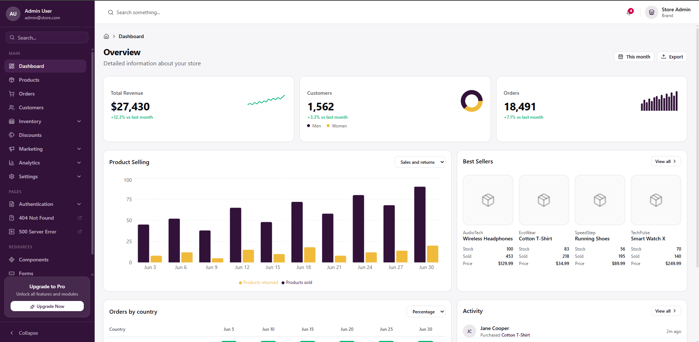

# Brisk Admin

A React admin dashboard template built with [Vite](https://vite.dev) and [react-router-dom](https://reactrouter.com) — a production-ready e-commerce admin starter with 30+ pages, charts, data tables, forms, and authentication screens.



## Live Demo

- **Docs / landing:** [codespanda.github.io/brisk-admin](https://codespanda.github.io/brisk-admin/)
- **Dashboard:** [codespanda.github.io/brisk-admin/#/dashboard](https://codespanda.github.io/brisk-admin/#/dashboard)

## Tech Stack

- **React 19** + **Vite 6** (TypeScript)
- **react-router-dom v7** for routing (HashRouter for GitHub Pages compatibility)
- **Tailwind CSS v4** + **shadcn/ui** components
- **Zustand** for state, **React Hook Form** + **Zod** for forms
- **TanStack Table** for data tables, **Recharts** for charts
- **next-themes** for theming, **Sonner** for toast notifications

## Getting Started

Install dependencies and run the development server:

```bash
npm install
npm run dev
```

Open [http://localhost:5173](http://localhost:5173) with your browser to see the result.

## Scripts

| Command             | Description                          |
| ------------------- | ------------------------------------ |
| `npm run dev`       | Start the Vite dev server            |
| `npm run build`     | Type-check and build for production  |
| `npm run preview`   | Preview the production build locally |
| `npm run lint`      | Run ESLint                           |

## Project Structure

- `index.html` → `src/main.tsx` → `src/App.tsx` (route table)
- Page components live under `src/pages/`, wired up explicitly in `src/App.tsx`
- `src/components` — shared UI and shadcn primitives; `src/features` — domain modules (products, orders, customers…)
- `src/layouts` — `DashboardLayout` and `AuthLayout` wrappers
- `src/stores` — Zustand stores (auth, sidebar, notifications)
- `src/services` — API client + mock service layer
- `src/docs` — self-contained template documentation (safe to delete)

## Removing the Docs

The `src/docs` folder is fully isolated — nothing in the app imports from it. To remove it:

1. Delete the `src/docs/` directory.
2. In `src/App.tsx`, remove the `DocsPage` import and the `/docs` route.
3. Change the root `<Route index>` to redirect to `/dashboard` instead.
